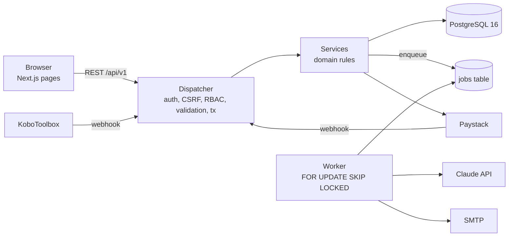
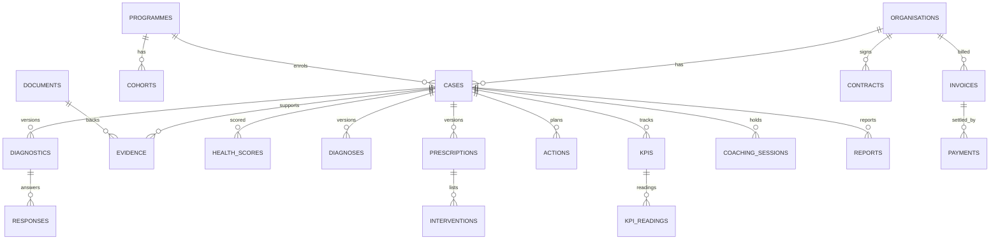

# Samakose platform: architecture

The Business Doctor as a production web application. Next.js (App Router) and TypeScript on PostgreSQL, with one REST API that the browser, the worker and future clients all use.

## 1. What is built and what is not

| Area | State |
|---|---|
| Auth: sign in, lockout, MFA (TOTP), reset, invite, sessions | Built and tested |
| RBAC: 10 roles (one EXPERT role replaces consultant and coach; what an expert may do on a case depends on being its lead or its coach), 29 resources, 10 actions (read, create, edit, approve, delete, export, override, assign, verify, certify), row scoping | Built and tested (every guarded route is checked for every role) |
| Organisations, programmes, cohorts, cases, lifecycle state machine | Built and tested |
| Expert and coach network: one profile photo capability for every person, practitioner profile and vetting (administrator approves), conflicts of interest, assignments with history and accept or decline, explained matching, three-source ratings (immutable), performance with sample size and confidence, caseload transfer | Built and tested (backend and screens). Migration 0028 was applied to production on 4 October 2026 and verified |
| UNLOCK: opportunities (funding, partners, markets, programmes, training) with their own eligibility criteria, a matcher that reads the Business Health Record and certification and explains every result, owner consent per referral, human approval, status history and awards | Built and tested (domain rules, API, database guards, browser journey). Not yet exercised by real users. Partners get no login; nothing is sent to a partner automatically |
| Delivery service levels and case messaging: a reminder before each coaching session, escalation of stalled cases and sessions with no recorded outcome (thresholds are administrator rules), and a message thread on each case (owner and practitioners write, managers read for oversight, messages cannot be edited, deleted by retention only) | Built and tested (domain rules, scans, API, database guards, browser journey). Migration 0030 not yet applied to production. Scans run daily on Vercel cron and hourly on the worker. Reminders and escalations are notices only: a person records session outcomes |
| Diagnostic with evidence classes, quality gate, scoring, rescoring | Built and tested |
| Framework versions: SME360 baseline, AgriFood360 and ESO360 shells. Diagnostics and scores point at the version they were produced under; published versions are immutable (database trigger); specialised frameworks need an approved evidence trail before publishing | Built and tested. AgriFood360 and ESO360 have no content and are not production-authoritative until approved by Amin Yahaya |
| Business Health Record: read-only history per organisation with the framework version and a reason for each score change | Built and tested |
| Score regression set: synthetic golden cases, failure names the case and dimension that moved | Built (`tests/regression`) |
| AI drafts: diagnosis, prescription, coaching brief, report (async jobs) | Built; tested against a mock model and an injectable transport. Not run against the live Claude API |
| Four-eyes review of prescriptions and reports | Built and tested |
| Actions, risks, KPIs, coaching sessions, reports and release | Built and tested |
| Finance: plans, contracts, invoices, payments, Paystack | Built; Paystack tested in mock mode and with a stubbed transport. Not run against live Paystack |
| KoboToolbox intake (webhook and pull) | Webhook tested. The pull job follows the documented API shape and has not run against a live server |
| Dashboards per role, funder views with small-cell suppression | Built and tested |
| Audit trail, events, notifications, email outbox, global search, CSV export | Built and tested |
| Admin: users, audit, rules, question bank, intervention library, system status | Built |
| Web UI for all of the above (58 pages) | Built. Exercised by four browser journeys (section 8) |
| Screens in the design set | 46 built, 37 partly built, 67 deferred, 67 reference boards. See `docs/SCREEN-MAP.csv` |

Not done, on purpose or for lack of time:
- No load or soak testing. Sizing advice in section 7 is reasoned, not measured.
- No antivirus hook on uploads (type allowlist, magic bytes, size cap and hash check only).
- No MFA recovery codes: an administrator resets MFA for a locked-out user.
- No partial payments. An invoice is paid in full or not at all.
- No SMS or WhatsApp notifications. Email (SMTP) and in-app only.
- Deferred design areas: marketplaces, digital twin and scenario engine, benchmarking, ESO command centres, workflow builder, offline field mode.

## 2. System shape

- **One route registry.** `defineRoute` declares method, path, permission, zod schemas and handler once. The catch-all `/api/v1/[...path]` dispatches it and the OpenAPI 3.1 file is generated from the same list (`npm run openapi`, output in `docs/openapi.json`, 179 operations).
- **The dispatcher does the cross-cutting work** so no handler can forget it: origin check on writes (CSRF), session lookup, MFA and forced-password gates, permission check, per-user and per-route rate limits, input validation, one transaction per write (data, audit and events commit together), error envelope `{error:{code,message,details,requestId}}`.
- **Pages are client components** that call the same API. There is no second data path, so what the UI shows is exactly what the API allows. The `(app)` layout enforces session, MFA and password gates on the server before any page renders.
- **Jobs run in Postgres** (`jobs` table, `FOR UPDATE SKIP LOCKED`, retries with backoff, terminal failures do not retry). The worker is a separate process; in-process draining also runs for small deployments. `POST /api/internal/cron` (Bearer `CRON_SECRET`) can drive scheduled work from an external scheduler.

## 3. Module map

| Module | Files |
|---|---|
| Framework | `src/api/framework.ts`, `list.ts`, `openapi.ts`, `schemas.ts` |
| Routes | `src/api/routes/auth.ts`, `work.ts`, `platform.ts` |
| Services | `src/services/*.ts`: auth, users, orgs, programmes, cases, diagnostics, evidence, clinical, delivery, reports, finance, dashboards, admin, kobo, ai, agents (admin), agent-gate (gateway), certificates, assistant |
| Domain rules | `src/domain/logic.ts` (scoring, state machine, gate), `scope.ts`, `events.ts`, `notify.ts`, `jobs.ts`, `job-handlers.ts`, `mockai.ts`, `agents.ts` (agent rules), `prompts.ts` |
| Security | `src/lib/rbac.ts`, `crypto.ts`, `session.ts`, `audit.ts`, `errors.ts` |
| Data | `src/db/schema.ts`, `migrations/*.sql`, `seed.ts` |
| UI | `src/app/(auth)`, `src/app/(app)`, `src/app/pay`, `src/components/**` |

## 4. Data model

35 tables. Identity: `users`, `sessions`, `user_tokens`, `user_programmes`. Portfolio: `organisations`, `programmes`, `cohorts`, `cases`. Assessment: `questions`, `diagnostics`, `responses`, `documents`, `evidence`, `health_scores`. Clinical: `diagnoses`, `library_items`, `prescriptions`, `interventions`. Delivery: `actions`, `risks`, `kpis`, `kpi_readings`, `coaching_sessions`, `reports`, `approvals`. Finance: `plans`, `contracts`, `invoices`, `payments`, `webhook_events`. Platform: `events`, `audit_log`, `notifications`, `outbox_emails`, `rules`, `jobs`, `rate_limits`, `ai_requests`, `ai_attempts`.

Integrity is enforced by the database, not only the app:
- **Append-only** (triggers refuse update and delete): `audit_log`, `events`, `kpi_readings`, `health_scores`, `approvals`, `responses`, `ai_attempts`. Diagnostics are fully immutable.
- **Versioned with a workflow column**: diagnoses (only `status` may change) and prescriptions (`status`, `reviewer_note`). A new version points at the old one through `supersedes_id`; the current version is the one nothing supersedes.
- **Constraints**: the reviewer of a case cannot be its consultant; one successful payment per invoice (partial unique index); owners must belong to an organisation; ranges and enums are CHECKed; codes come from sequences and are never reused.

## 5. Workflows

Case states: PROSPECT, ONBOARDING, PROFILED, DIAGNOSTIC, DIAGNOSED (scored and diagnosis approved), PRESCRIBED, APPROVAL, IN EXECUTION, COACHING, MONITORING, MIDLINE, ENDLINE, FOLLOW-UP, GRADUATED, RE-ENTRY.
- Moves whose conditions are facts (a validated diagnostic exists, a score exists, an approved diagnosis, a prescription in review or approved, a started action, three held sessions) happen automatically after the change that made them true. The case page shows what is still missing.
- Moves that need judgement (for example ENDLINE to FOLLOW-UP) are manual, need a confirm step and are limited to the right role.
- **Scoring is synchronous** on submission and again when evidence is verified or rejected. A change of 5 points or more emits an event.
- **AI steps are asynchronous jobs.** Each call sends only minimal context (no names or contacts), validates the reply against a schema, retries once with the validation errors, and logs every request and attempt. A person always approves: diagnoses by the consultant, prescriptions and reports by the case reviewer (four-eyes: not the author, not the consultant, and not an administrator).
- **Approving a prescription** turns its interventions into actions and KPIs with owners and due dates.
- **Payments:** initialise with Paystack (or the labelled test checkout when no key is set), verify on return, and reconcile from the signed webhook (HMAC-SHA512, idempotent by event id, amount and currency checked). A second payment for a paid invoice is recorded as Failed and raises an event for a person to refund or reconcile.

### Expert and coach network
- **One photo capability.** `/me/photo` (and `/users/:id/photo` for administrators) accepts PNG, JPEG or WebP up to 4 MB, checks the file signature, crops to a 320 px square, converts to WebP and strips metadata. One shared `Avatar` component renders it everywhere, with initials when there is no photo.
- **Profiles and vetting.** Every EXPERT has one profile (expert, coach or both). Draft, Submitted, Approved, Rejected, Suspended. Only an administrator decides; a rejection or suspension needs a reason. A material change after approval returns the profile to review. Only Approved profiles can be assigned.
- **Assignments are rows, not fields.** `case_assignments` holds lead, specialist, coach and reviewer with reason, history and the person's response. `cases.consultant_id`, `coach_id`, `reviewer_id` remain as a read-through pointer written only by `services/assignments.ts`. Hard rules: approved, no declared conflict, reviewer independent of everyone on the case. Capacity and unavailability are warnings.
- **Matching recommends, a person decides.** Score = expertise 35, sector 15, platform 10, size 5, region 10, capacity 15, experience 10, each with a stated reason. Performance is not part of the score until there is enough rated history.
- **Ratings.** The business, the case reviewer and the programme manager rate separately (immutable table, enforced by a trigger). Performance rescales over the evidence available and always shows its sample size and confidence. It only suggests a status; an administrator decides.

### AI agent governance

- An agent is a worker, not a user. It has no login and no permissions of its own. It runs under the requesting person's account and case scope, so it can never see more than that person.
- Registry: `ai_agents` and `ai_agent_versions`. A version freezes the prompt, model and configuration (database trigger). Changing any of them makes a new version; only evaluation fields can change on an existing one.
- Lifecycle: Draft, Configured, Testing, Evaluation, Approval required, Active, Paused, Disabled, Archived. An administrator can pause or disable from any running state. Every move needs a reason and is audited with the version that was current.
- Autonomy is capped at Level 2 (recommend, a human approves), in the application and by a database check. Levels 3 to 5 are not built.
- Live model gate: on the mock model any agent in Testing, Evaluation, Approval required or Active may run. On the live model only an Active agent may run, and Active needs a passed evaluation of its current version. The evaluation run itself is the one exception. No live evaluation has passed yet, so no agent can be Active.
- Usage limits per agent (requests and tokens, day and month, warning at 80%, then throttle or pause). The defaults are placeholders until a monthly cost cap is set.
- A refused task is recorded in `ai_requests` with the reason and the requester is told to do the work by hand. The audit log records whether an action was by a person, an agent or both (`actor_type`).
- Roles stay defined in code (`src/lib/rbac.ts`), not in the database. The administrator manages agents; the executive can read.

### Certification and the website assistant

- **Certificate** (`certificates`, migration 0016, rules in `src/domain/certification.ts`). A business is certified on verified evidence, not on a score alone. Eligibility needs: a validated score on a published framework version, no blocking gate question, no Critical domain, confidence Medium or High, verified or document-supported evidence covering the set share of answers, a reviewed diagnosis and an approved prescription. Levels: Foundation, Established, Investment-ready (the last also needs a Ready readiness index). All thresholds, the evidence share and the validity period are rules in Settings.
- **Four eyes:** the lead expert (or an administrator) proposes. A different person, a reviewer or administrator who is not on the case team, decides. Enforced in the service and by a database check. Eligibility is checked again at the decision. A certificate lasts the set number of months, shows as Expired after that, and can be revoked with a reason. Declined and revoked records are final and nothing is deleted.
- **Migrations and table ownership** (migration 0018). The application connects as the role `samakose_app`, which must own every table. A table created by a console or MCP session is owned by `postgres` and the app cannot use it. After applying any migration to a hosted database, run `select tablename, tableowner from pg_tables where schemaname='public' and tableowner<>'samakose_app'`; it must return no rows.
- **Sharing and the investment pack** (migration 0017). The owner can turn on a public confirmation page (`/verify/<certificate id>`) that shows only the business name, level, issue and expiry dates and whether it is Valid, Expired or Revoked. It is off by default, reveals nothing for an unshared or unknown id, and is rate limited. The investment readiness pack (a printable summary of level, score, evidence coverage, readiness and the approved plan) exists only for a valid Investment-ready certificate. Risks and AI drafts stay internal and are not in it.
- **Unlocks** are the framework's own text: each readiness index states what reaching it opens, and a certificate lists those for indices that are Ready or Conditionally ready. Wiring an unlock to a real feature is done per item.
- **Enquiry Assistant** (`src/services/assistant.ts`). A public chat on the website that answers only from published FAQs and articles, runs through the AI gateway as a registered agent (pause, limits, cost cap, audit), refuses prices, promises, scores, certification claims and links, never reads drafts, and hands anything else to a person. It is off until an administrator turns on the switch in Settings. Pages are built ahead of time, so the widget asks the server whether it is on.

## 6. Security

- Passwords hashed (scrypt); policy of 12 or more characters that is not the name or email; lockout after 5 failures for 15 minutes; one message for wrong password and unknown user.
- Sessions in HttpOnly, SameSite=Lax cookies (`__Host-` prefix and Secure in production), server-side revocation, idle and absolute expiry.
- TOTP MFA with the secret encrypted at rest (AES-GCM). `MFA_REQUIRED_ROLES` forces setup for chosen roles.
- CSRF by Origin check on writes; strict CSP, frame denial, nosniff and HSTS headers in `next.config.ts`.
- Row scoping in `src/domain/scope.ts`: out-of-scope records answer 404, so existence is not revealed. Non-UUID ids answer 404.
- Uploads: type allowlist, magic-byte check, size cap, sanitised names, SHA-256 verified on download, served as attachments.
- Every write is audited with actor, IP, before and after. Funder views suppress groups under the minimum size (`privacy.min_cell_size`, default 5), including secondary suppression so a hidden cell cannot be derived by subtraction. Programme counts are suppressed for funders too.
- Rate limits are stored in the database so they hold across instances.

Known limits: permissions at the service level are narrower than the matrix in `rbac.ts` in a few places (for example owners can pay invoices but not list payments); organisations that no case has claimed are visible to programme managers and consultants so a case can be opened for them.

## 7. Deployment and scale

- **Cloud PaaS (Render, Railway, Fly):** deploy the `web` and `worker` Docker targets and a managed Postgres. Set `DATABASE_URL`, `SESSION_SECRET`, `CRON_SECRET`, `APP_URL`, and mount a volume at `STORAGE_DIR` for both.
- **Own VPS or a Ghana data centre:** `docker compose up --build` gives db, migrations, web and worker. Put Caddy or nginx in front for TLS and set `TRUST_PROXY=1` only when the proxy sets `X-Forwarded-For`. Back up the Postgres volume and the file volume together.
- **Scaling path:** the web tier is stateless, so add instances behind a load balancer. Workers scale the same way because job claiming is safe under concurrency. Move file storage to S3-compatible object storage by replacing the small functions in `src/services/evidence.ts` before running more than one web host without a shared volume. Add a read replica for dashboards if they become heavy. These points are design reasoning; no load test has been run.
- **Configuration:** see `.env.example`. With no keys the system runs in safe modes: `AI_MODE=mock`, Paystack test checkout, email logged only. `/admin/system` shows which mode is active.

## 8. Test evidence

- `npm test`: 17 test files, 360+ tests against a real PostgreSQL 16 (logic, auth, full journey, security and RBAC matrix, integrations, database rules, framework versions, score regression). The database is dropped and rebuilt from the real migrations for each run.
- `npm run test:e2e`: four Chromium journeys against a running production build with demo data: a role-by-role sweep (every page each of the roles can reach, at 1280px and 375px, no errors, no horizontal overflow), the case lifecycle through the UI to reviewer approval and generated actions, finance to owner payment with the test checkout, and KPI reading, coaching session and report release.
- Not covered: screen-reader testing, load, live Claude, live Paystack, live Kobo, real SMTP delivery.

## 9. Moving from the Google Workspace MVP

Everything the MVP did is in this platform (see the comparison in the delivery note): the 18-question form, quality gate, deterministic scoring, four agents, four-eyes review, actions and KPIs, coaching brief, report and release. The Kobo form does not need to change: `q_Q01`, `e_Q01`, `ref_Q01` and `case_id` are read as well as `Q01`, `Q01_evidence`, `Q01_ref` and `case_code`. The webhook expects the case code (for example `CASE-2026-000001`) in that field. The MVP's sheet data is not migrated automatically; at pilot scale re-enter organisations and open cases through the UI or import through the API.
